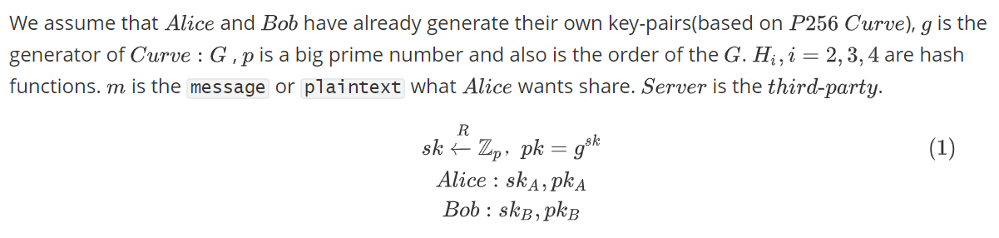

# goRecrypt
`goRecrypt` is a tool to execute proxy re-encryption algorithms. It offers a high-level API to easily implement the process of re-encryption.

# Introduction and Theory


## Prerequisites



## Encrypt


## ReKeyGen


## ReEncryption


## ReCreateKey


## Decrypt


# Getting started

## Install

```sh
$ go get -v github.com/gongzhaoxu/goRecrypt
```

## Test

### Code

```go
package main

import (
	"fmt"
	"goRecrypt/curve"
	"goRecrypt/recrypt"
)

func main() {
	//-------------------------------预准备-------------------------------
	// Alice生成密钥对
	aPriKey, aPubKey, _ := curve.GenerateKeys()
	// Bob生成密钥对
	bPriKey, bPubKey, _ := curve.GenerateKeys()
	//明文
	m := "Hello, 代理重加密"
	fmt.Println("origin message:", m)
	//-------------------------------加密---------------------------------
	// Alice加密，返回cipherText即m_enc 、capsule
	cipherText, capsule, err := recrypt.Encrypt(m, aPubKey)
	if err != nil {
		fmt.Println(err)
	}

	fmt.Println("ciphereText:", cipherText)
	fmt.Println("capsule:", capsule)

	//-------------------------------重加密秘钥生成---------------------------------
	// Alice生成重加密秘钥rk
	rk, pubX, err := recrypt.ReKeyGen(aPriKey, bPubKey)
	if err != nil {
		fmt.Println(err)
	}
	fmt.Println("rk:", rk)

	//-------------------------------代理执行重加密---------------------------------
	newCapsule, err := recrypt.ReEncryption(rk, capsule)
	if err != nil {
		fmt.Println(err.Error())
	}
	//-------------------------------解密---------------------------------
	// Bob解密原始明文
	plainText, err := recrypt.Decrypt(bPriKey, newCapsule, pubX, cipherText)
	if err != nil {
		fmt.Println(err)
	}

	// 输出 plainText
	fmt.Println("plainText:", string(plainText))

}
```

### Result

```go
origin message: Hello, 代理重加密
对称密钥字节流: 06d91555577102d023e177c6ab07772aea6789b4058015d51f9970cb505f6711
ciphereText: [232 40 96 212 59 204 36 221 123 199 61 43 146 241 163 240 252 181 154 109 125 198 220 198 7 237 122 239 106 215 189 143 20 110 131 161 236 106]
capsule: &{0xc000075350 0xc000075380 71406603960690457799409919793001160234678313476065294771468672403123794630622}
rk: 10833369513618945448249494246804646031917851383795605106047959096088651612577
plainText: Hello, 代理重加密
```